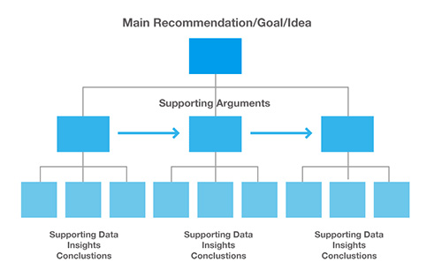

# Reveal.js for business

### How to structure thoughs and rendering

---

## MECE pyramid

MECE pyramid allows to structure thought from:
* key message 
* to supporting thouhts/arguments
* to supporting data 

----

## MECE pyaramid (Breadth first) v Scholar - #1

* MECE focus on arguments exploration on breadth first, vs
* school argument exploration being depth first...

<iframe data-src="https://en.wikipedia.org/wiki/Breadth-first_search" width="445" height="355" frameborder="0" marginwidth="0" marginheight="0" scrolling="no" style="border:3px solid #666; margin-bottom:5px; max-width: 100%;" allowfullscreen> </iframe>

----

<!-- .slide: data-background-iframe="https://en.wikipedia.org/wiki/Thesis,_antithesis,_synthesis" data-background-interactive-->

## MECE pyaramid v Scholar (Depth first) #2

Whereas school around the world focus on going deep first

----

## MECE pyaramid vs Scholar #3

Another analogy is Google vs Yahoo

---

## reveal.js focuses on rendering structured thoughts

* press `ESC` to show the entire slidedeck structure
* multi-tier presentation supported
* links to external web sites/presentation for supporting data 

----

## Reveal.js - supporting #1

----

## Reveal.js - supporting #2

iframe in 2nd level provide equivalent to MECE 3rd level  
