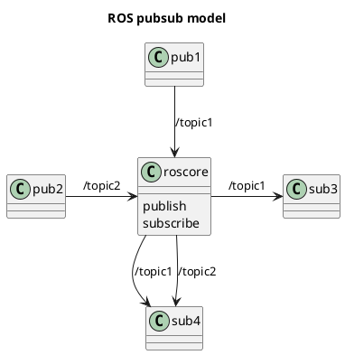

# Plantuml

> Automating text to diagram generation
Notes: Examples notes

---

## UML Diagrams and more

| Sequence   | Use Cases | Class                 | Activity      |
|------------|-----------|-----------------------|---------------|
| ![][seq]   | ![][uc]   | [![][class]][class_w] | ![][activity] |

[seq]: https://s.plantuml.com/imgw/img-2694ca9a35b51a04d49c3be64163a530.webp
[uc]: https://s.plantuml.com/imgw/img-c6a75c503d93f32b1d206853222c0ec8.webp
[class]: https://s.plantuml.com/imgw/img-f15b2374240c54a96993f94f8a76ed41.webp
[class_w]:https://plantuml.com/class-diagram
[activity]: https://s.plantuml.com/imgw/img-de92784b574768a895512e4c0ab6d6fa.webp

----

| Component  | State     | Object     | Deployment    |
|------------|-----------|------------|---------------|
| ![][comp]  | ![][state]| ![][obj]   | ![][deploy]   |

[comp]: https://s.plantuml.com/imgw/img-39870b730e2d881e2efeff2cd806a54a.webp
[state]:https://s.plantuml.com/imgw/img-f63dfc8d82dc5f67ef64eb3b4cce1090.webp
[obj]:https://s.plantuml.com/imgw/img-39870b730e2d881e2efeff2cd806a54a.webp
[deploy]:https://s.plantuml.com/imgw/img-85f76cbce14eeb2f6817c3ddd2bd20dc.webp

----

| Timing     | Network   | Wireframe  | Rest          |
|------------|-----------|------------|---------------|
| ![][timing]| ![][nw]   | ![][wf]   | to come       |

[timing]:https://s.plantuml.com/imgw/img-a4c61d5d4b213bb37c88093517279c39.webp
[nw]:https://s.plantuml.com/imgw/img-f4b7448e42d7b655077c71729fb63927.png
[wf]:https://s.plantuml.com/imgw/img-2f0577cbf8131ba601d623eb8e5036ac.webp

---

## Class Diagrams

