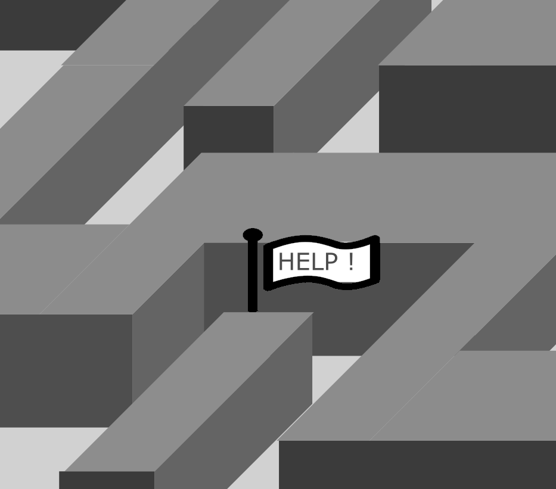

# Sensor Fusion Beore getting started

> Are you lost, not sure where to start let alone where to go?

Notes: Examples notes

---

## Sensor Fusion 

> Leaning to ride a bike is often the human first sensor fusion experience 

----

## Sensor Fusion: the 3 C's of fusion

* Competitive: dual channel approach ( 2 overlaping cameras) <!-- .element: class="fragment" data-fragment-index="1" -->
* Complementary: appending overlapping sensor data (e.g. front and rear camera) <!-- .element: class="fragment" data-fragment-index="2" -->
* Cooperative: complemntary to add more incormation (2 cameras to enable stereoscopic views) <!-- .element: class="fragment" data-fragment-index="3" -->

Notes: Remmeber to say something funny here: 3C of F has nothing to do with the 3 coins in the fountain from Sinatra (1954 movie)

----

## Sensor Fusion: the 5 Levels of fusion

0. Data alignment <!-- .element: class="fragment" data-fragment-index="1" -->
1. Entity assessment (e.g. signal/feature/object). <!-- .element: class="fragment" data-fragment-index="2" -->
2. Tracking and object detection/recognition/identification <!-- .element: class="fragment" data-fragment-index="3" -->
3. Situation assessment <!-- .element: class="fragment" data-fragment-index="4" -->
4. Impact assessment <!-- .element: class="fragment" data-fragment-index="5" -->
5. Process refinement (i.e. sensor management) <!-- .element: class="fragment" data-fragment-index="6" -->
6. User refinement <!-- .element: class="fragment" data-fragment-index="7" -->

---

## ROS

<ul>
   <li> 2007 *real* start to avoid constant re-inventing the wheel </li>
   <li> 2012 <a href="https://rosindustrial.org/briefhistory">ROS-I</a> github launched </li>
   <li> 2017 <a href="https://index.ros.org/doc/ros2/Releases/">ROS2<a/>, 
      <small><a href="https://www.generationrobots.com/blog/en/ros-vs-ros2/">1v2,</a></small>
        <small><a href="https://design.ros2.org/articles/why_ros2.html">why</a></small></small> </li>
</ul>
<iframe data-src="https://www.theconstructsim.com/timeline-robot-operating-system-ros/" width="800" height="600" frameborder="0" marginwidth="0" marginheight="0" scrolling="yes" style="border:3px solid #666; margin-bottom:5px; max-width: 100%;" allowfullscreen> </iframe>

Notes: What is ROS, let's do a little look back in the future of robotics. We can also have a look at the official ROS timeline in this small iframe

---

<!-- .slide: data-background-iframe="https://wiki.ros.org/ainstein_radar/Tutorials/Radar%20and%20camera%20sensor%20fusion" data-background-interactive-->

    <h2>mmWave and vision fusion in ROS </h2>
  <ul> 
    <li> Why re-invent the wheel? </li>
    <li> When demo already on ROS tutorial </li>
    <li> Well because TI mmwave has many more built-in features making fusion stronger and faster </li>
    <li> and because next step is to do fusion with industrial cameras with  </li>
  </ul>

---
